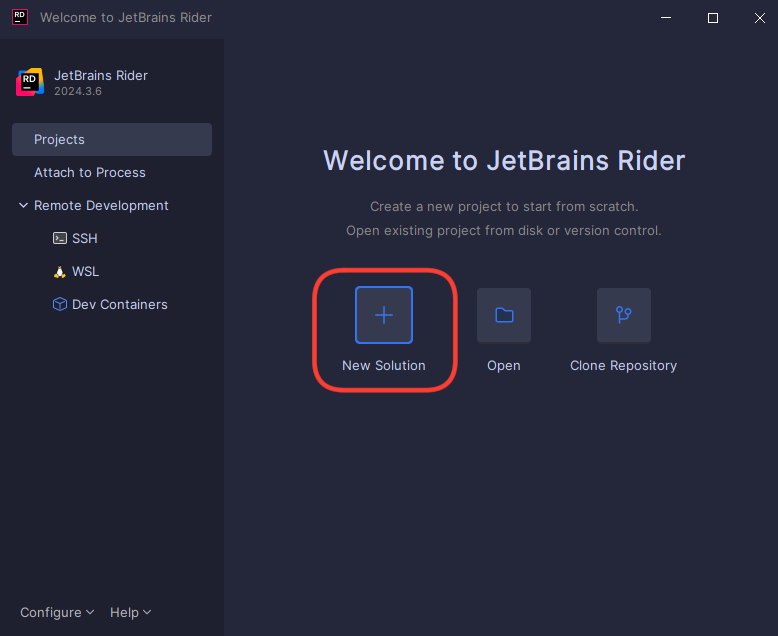
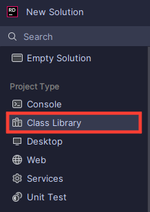
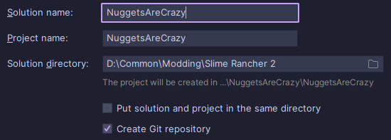

After fulfilling the prerequisites in the [Introduction](introduction.md) page, we can continue onto setting up your first project, and getting everything going!

## Introduction

For this part of the guide, it is ideal that you already have your **IDE** open, and on the launch screen. To add for that, for the entirety of this guide, we will be following the recommended usage of **Rider**.

If you're using **Visual Studio**, or any other IDE, there should be similarities.

### Creating a C# Class Library Project

When you first open Rider, you should see something similar to this window. Now, we must create a new solution for our C# project.

{ width=500 }

{==Click on the button showcased in the image, highlighted by the red box above==}.

Now that you've done that, you may feel a bit unsure about what's on the window. **Let's focus on this sector on the left for now**.

Make sure that, if not by default, you have `Class Library` selected as your `Project Type`. {==Do *not* select anything else==}. It is also highlighted by a red box in the image above.

Afterwards, **look at this section of the window more on the right**. 

Here you can name your solution, and project. I recommend keeping them the exact same, and when editing the solution name it should automatically copy it over to your project name.

!!! info "It is best to mention..."

    **Please do not copy what is in the image**, write the name of the mod that you're creating. 
    
    Throughout this guide, I will be creating a mod while also teaching you how to make a mod of your very own. You should *not* copy it, including it's naming. Write your own code, and adapt it to what you want to create for yourself.

You could also set the directory path for your mod project. If you do not have one you'd like to change it to, the default path can suffice. So don't worry about it!

We're almost done with this part. Now, make sure that your `Type` says `Class Library`. You also need to select your targeted framework.

If you can recall from the prerequisites in the [Introduction](introduction.md), you should've installed the `.NET Framework`. When you click on the dropdown highlighted in the image above, select `v4.8.1`.

{==Now all you have to do is click `Create` at the bottom of the window==}, and you've successfully created your first C# project! :D